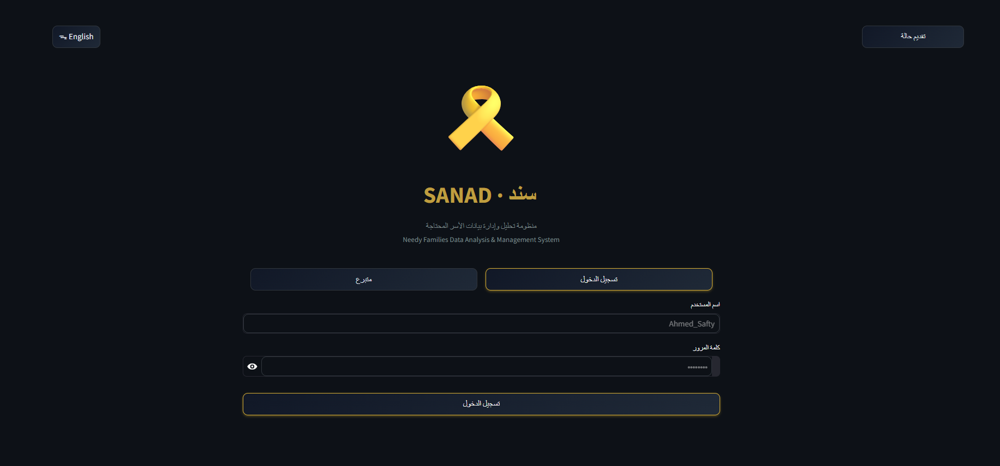

<div align="center">

# 🎗️ سند · SANAD
### Needy Families Data Analysis & Management System

[](https://python.org)
[](https://streamlit.io)
[](https://scikit-learn.org)
[](https://www.docker.com/)

> An AI-powered social welfare platform that uses **Gaussian Mixture Model (GMM) clustering** to automatically classify needy families by vulnerability level — enabling NGOs and aid organizations to prioritize and allocate resources more effectively.

</div>

---

## Overview

**Sanad AI** is a bilingual (Arabic/English) web application built to help social workers, NGO administrators, and donors manage and understand the needs of underprivileged families in Egypt.

The system handles the full pipeline — from **data collection** (public submission forms) to **AI-powered classification** to **dashboard analytics** — making it easy to identify the most critical cases and act fast.

> ⚠️ **Note:** The current version uses **synthetically generated data** as a prototype. The system is designed to be directly integrated with real-world data from organizations like **Hayah Karima (حياة كريمة)** once partnership is established.

---

## Key Features

### Public Portal
- Families can submit aid requests directly via a public form (no login required)
- Bilingual interface — full Arabic RTL + English LTR support
- Automatic AI classification upon submission

### Admin Dashboard
- Secure login with hashed password storage
- Full case management — search, filter by governorate, cluster, and more
- Add new cases manually with instant AI classification
- View both the main database and newly submitted cases
- Create additional admin accounts from within the dashboard

### Donor Portal
- View anonymized statistics and need maps without registration
- Explore need levels by governorate, district, and village
- Integrated donation flow via InstaPay, Vodafone Cash, and WhatsApp

### Analytics
- Interactive charts: cluster distribution, governorate breakdown, income histogram, family size by cluster
- KPI cards: total cases, critical cases, average income, governorate count
- Additional stats: chronic disease, disability, debt, rural/urban breakdown

---

## System Architecture

```
┌─────────────────────────────────────────────────────┐
│                    Sanad AI App                     │
├────────────────┬────────────────┬───────────────────┤
│  Public Form   │  Admin Panel   │   Donor Portal    │
│  (No Login)    │  (Auth + CRUD) │   (Read Only)     │
└───────┬────────┴───────┬────────┴───────────────────┘
        │                │
        ▼                ▼
┌───────────────┐  ┌─────────────────────────────────┐
│ new_cases.csv │  │          database.csv           │
│ + AI Cluster  │  │ (main dataset + cluster labels) │
└───────────────┘  └──────────────┬──────────────────┘
                                  │
                    ┌─────────────▼──────────────┐
                    │        ML Pipeline         │
                    │  Preprocessor → PCA → GMM  │
                    └────────────────────────────┘
```

---

## ML Pipeline

The classification pipeline consists of three stages:

### 1. Preprocessing (`sanad_processor.pkl`)
- Handles missing values, encodes categorical variables, scales numerical features
- Engineered features include:
  - `log_income` — log-transformed monthly income
  - `log_debt` — log-transformed debt amount
  - `health_burden` — composite score (chronic disease + disability)
  - `edu_weight` — ordinal encoding of education level
  - `is_disabled` — binary flag for disabled household members

### 2. Dimensionality Reduction (`sanad_pca.pkl`)
- PCA applied after preprocessing to reduce noise and improve cluster separation

### 3. Clustering (`sanad_gmm_model.pkl`)
- **Gaussian Mixture Model (GMM)** — chosen over K-Means for its ability to model elliptical, overlapping clusters and assign soft probabilities
- Outputs one of **4 vulnerability clusters** per family

### Fallback Heuristic
If model files are unavailable, the system falls back to a simple income-based rule:

| Monthly Income | Assigned Cluster |
|---|---|
| < 500 EGP | 0 — Critical |
| 500 – 1,499 EGP | 1 — High Vulnerability |
| 1,500 – 2,999 EGP | 2 — Moderate Vulnerability |
| ≥ 3,000 EGP | 3 — Relative Stability |

---

## Data

### Synthetic Dataset
The prototype uses **synthetically generated data** that mirrors the statistical distribution of real Egyptian household survey data. It covers 35+ features per family including:

- Demographics: age, gender, family size, number of children
- Geography: governorate, center, village, rural/urban
- Economics: monthly income, income source, stability, expenses, debt
- Education: level, literacy, children in school
- Health: chronic disease, disability, medical costs
- Employment: status, years of experience, skills, job stability
- Assets: savings, owned assets, water/electricity access

### Real Data Integration
The system is architecturally ready to plug in real data from organizations like **Hayah Karima**. The only requirement is that the CSV follows the defined schema (`database.csv` column structure).

---

## Screenshots

<table style="width:100%; text-align:center;">
  <tr>
    <th>Login Page</th>
    <th>Admin Dashboard</th>
  </tr>
  <tr>
    <td></td>
    <td></td>
  </tr>
  <tr>
    <th>Case Management</th>
    <th>Donor Statistics</th>
  </tr>
  <tr>
    <td></td>
    <td></td>
  </tr>
  <tr>
    <th>Donation Page</th>
    <th>Need Map</th>
  </tr>
  <tr>
    <td></td>
    <td></td>
  </tr>
</table>

---

## Project Structure

```
sanad-ai/
│
├── app.py                   # Main Streamlit application
|
├── Data-Analysis-and-ML-Pipeline.ipynb
│
├── PKL/                     
│   ├── sanad_processor.pkl
│   ├── sanad_pca.pkl
│   ├── sanad_gmm_model.pkl
│   ├── features_list.pkl
│   └── cluster_mapping.pkl
│
├── Database/
│   ├── database.csv         # Main family dataset (synthetic)
│   ├── new_cases.csv        # Public submissions (auto-created)
│   ├── sanad_users.json     # Admin credentials (hashed)
│
├── Dockerfile               # Docker image configuration
├── .dockerignore            
├── .gitignore               
├── requirements.txt         
├── LICENSE
└── README.md
```

---

## Installation

### Option 1 — Local Installation

```bash
# 1. Clone the repository
git clone https://github.com/Mohamed-n-Bashar/Sanad-Ai.git
cd sanad-ai

# 2. Create a virtual environment
python -m venv venv

# Activate the virtual environment
# Linux / macOS
source venv/bin/activate

# Windows
venv\Scripts\activate

# 3. Install dependencies
pip install -r requirements.txt

# 4. Run the application
streamlit run app.py
```

---

### Option 2 — Docker

If you have Docker installed, you can run SANAD without installing Python or any dependencies.

```bash
# 1. Build the Docker image
docker build -t sanad-ai .

# 2. Run the container
docker run -p 8501:8501 sanad-ai

# 3. Then open your browser and navigate to:
http://localhost:8501

# To stop the application, press:
Ctrl + C

```

### `requirements.txt`
```
streamlit>=1.32.0
pandas>=2.0.0
numpy>=1.24.0
scikit-learn>=1.3.0
plotly>=5.18.0
joblib>=1.3.0
```

---

## Usage

### Default Admin Login
| Username | Password |
|---|---|
| `admin` | `admin123` |


### User Roles

| Role | Access |
|---|---|
| **Admin** | Full dashboard, case management, add/classify cases, create accounts |
| **Donor** | Statistics, need map, donation page (no login required) |
| **Public** | Submit aid request form (no login required) |

---

## Cluster Definitions

| Cluster | Label | Description | Priority |
|---|---|---|---|
| **0** | 🔴 Critical — Highest Priority | Extreme poverty with high health & education burdens. Immediate intervention required. | 1 |
| **1** | 🟠 High Vulnerability — Urgent Support | Low income, unstable household. Needs economic & developmental support. | 2 |
| **2** | 🟡 Moderate Vulnerability — Regular Follow-up | Moderate condition with some risks. Benefits from empowerment programs. | 3 |
| **3** | 🟢 Relative Stability — Empowerment | Relatively better-off. Needs development & skill-building programs. | 4 |

---

## Roadmap

- [x] Bilingual UI (Arabic RTL + English)
- [x] GMM-based automatic family classification
- [x] Public aid request submission with AI prediction
- [x] Admin dashboard with charts and case management
- [x] Donor portal with need map and donation flow
- [ ] Integration with real NGO data (Hayah Karima)
- [ ] Export reports as PDF / Excel
- [ ] SMS/Email notifications for submitted cases
- [ ] Mobile app version

---

## Team

Built with ❤️ for social impact in Egypt.

| Name |
|---|
| **Mohamed Wageh Salama** |
| **Mohamed Nabil Bashar** |
| **Abdelrahman Elsayed Saad** |
| **Eman Magdy Zakaria** |
| **Rawda Ibrahim Hamza** |

---

## License

This project is licensed under the **Apache License** — see the [LICENSE](LICENSE) file for details.

---

<div align="center">
<sub>سند · SANAD</sub>
</div>
